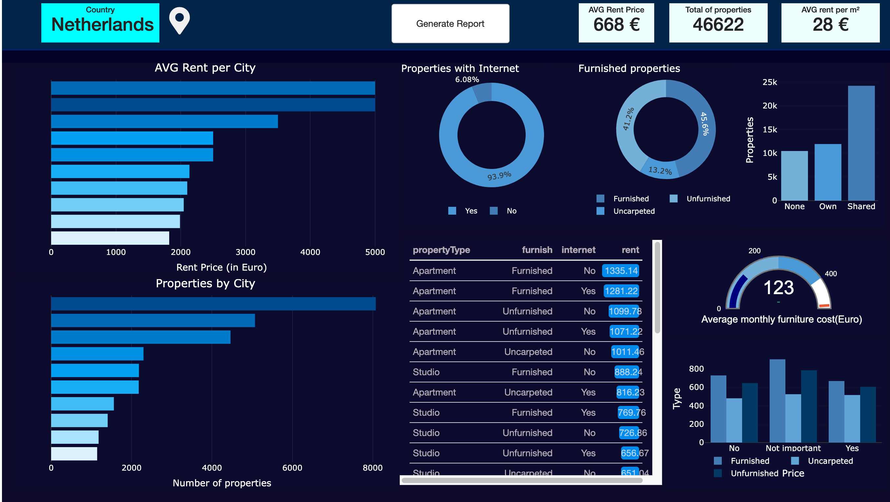
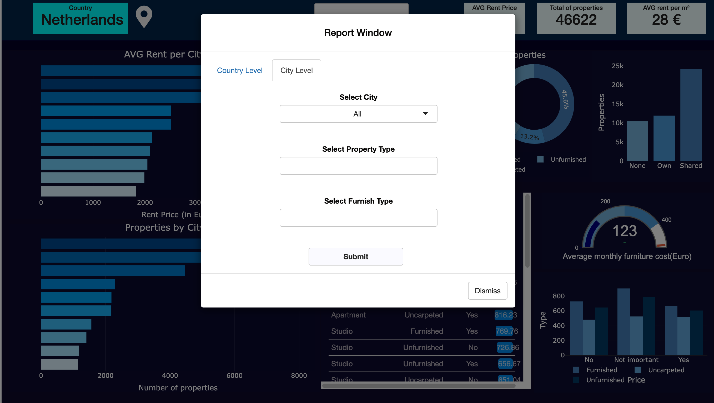

# Rent Price and Property Dashboard

This project is built using **R Shiny**, a powerful framework for
creating interactive web applications directly from R. It demonstrates
the use of R Shiny and its development tools to build a professional and
interactive property dashboard.

## Introduction

With **R Shiny**, developers can create responsive dashboards that allow
users to interactively explore data. This dashboard provides insights
into rental prices, property availability, internet accessibility, and
furnishing details for various cities in the Netherlands. Users can
filter data at both the **Country Level** and **City Level**, exploring
rental trends, property types, and related statistics.

## How to Use the Dashboard

### 1. Overview Panels

At the top of the dashboard, you will see three key metrics: - **Average
Rent Price** (in Euros) - **Total Number of Properties** listed -
**Average Rent per square meter (m²)**

These metrics provide a quick snapshot of the country's or city's real
estate market.

### 2. Country-Level Overview

-   **Graphs**: Show the average rent prices and the number of
    properties across different cities in the Netherlands.
-   **Donut Charts**: Visualize the percentage of properties with
    Internet Access and the share of Furnished vs. Unfurnished
    properties.
-   **Data Table**: Lists specific property details such as property
    type, furnishing status, internet availability, and rent prices.
-   **Gauge Chart**: Displays the **Average Monthly Furniture Cost** for
    furnished properties, indicating potential additional costs for
    tenants.

### 3. City-Level View

In the **City-Level Report**, you can select a specific city from the
drop-down list to view more detailed data, including: - **Average Rent
Price by Property Type** (Apartment, Studio, etc.) - **Furnishing Type**
(Furnished, Unfurnished, Uncarpeted) - **Location Map**: Displays
property locations within the selected city.

Once you select your filters, click **Submit** to update the dashboard
with the corresponding data.

### 4. Generating Reports

You can generate custom reports based on the current data view by
clicking the **Generate Report** button at the top of the dashboard. The
report can be downloaded as a PDF and includes all visualizations and
tables shown on the dashboard.

### 5. Graphs and Tables

-   **Bar Charts**: Visualize the average rent per city and the number
    of properties.
-   **Pie Charts**: Display the proportion of properties with specific
    features, such as Internet Access or Furnishing Status.
-   **Interactive Table**: Lists property information, including rent
    prices, furnishing, and internet availability.
-   **Histogram**: Shows the price distribution of rent prices across
    properties.

### 6. Filtering and Interaction

The dashboard is fully interactive. You can filter by city, property
type, furnishing status, and more to explore the data in various ways.
The filters update the entire dashboard in real time.

## Key Insights

-   **Rental Price Comparison**: Easily compare rental prices across
    cities and property types.
-   **Property Availability**: View the number of properties available
    in each city.
-   **Furnishing and Internet**: Analyze how furnishing status and
    internet availability affect rent prices.

## Conclusion

This dashboard showcases the capabilities of **R Shiny** for building
data-driven web applications. It is a valuable tool for individuals
interested in real estate data, offering insights into rental markets
across cities in the Netherlands.

## Installation and Setup

1.  **Clone the repository**: \`\`\`bash git clone
    <https://github.com/yourusername/rent-property-dashboard.git>
