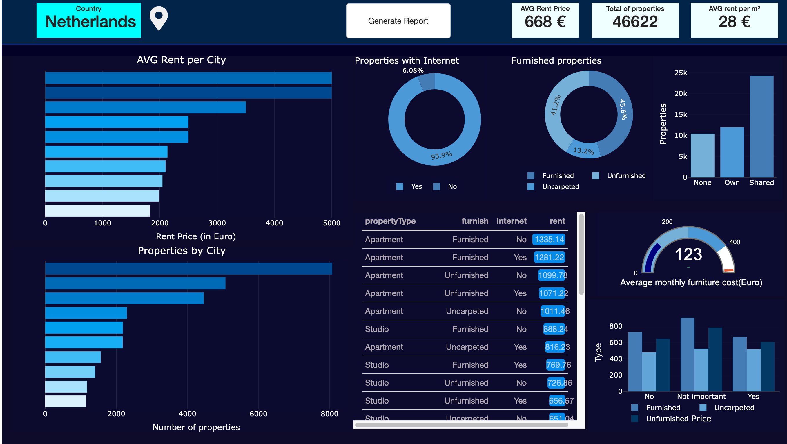
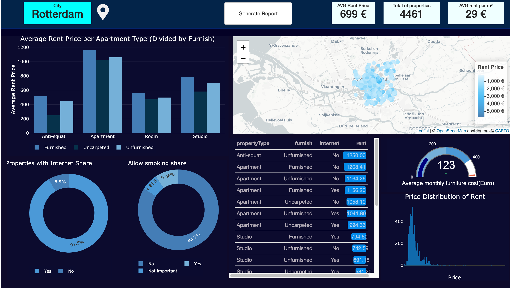
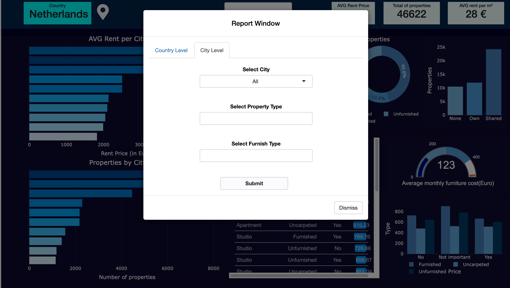

# Rent Price and Property Dashboard        url: https://yw93hx-midou-seddik.shinyapps.io/project/ 

This project is built using **R Shiny**, a powerful framework for creating interactive web applications directly from R. It demonstrates the use of R Shiny and its development tools to build a professional and interactive property dashboard.

## Introduction

With **R Shiny**, developers can create responsive dashboards that allow users to interactively explore data. This dashboard provides insights into rental prices, property availability, internet accessibility, and furnishing details for various cities in the Netherlands. Users can filter data at both the **Country Level** and **City Level**, exploring rental trends, property types, and related statistics.

## How to Use the Dashboard

### 1. Overview Panels

At the top of the dashboard, you will see three key metrics: - **Average Rent Price** (in Euros) - **Total Number of Properties** listed - **Average Rent per square meter (m²)**

These metrics provide a quick snapshot of the country's or city's real estate market.

### 2. Country-Level Overview

-   **Graphs**: Show the average rent prices and the number of properties across different cities in the Netherlands.
-   **Donut Charts**: Visualize the percentage of properties with Internet Access and the share of Furnished vs. Unfurnished properties.
-   **Data Table**: Lists specific property details such as property type, furnishing status, internet availability, and rent prices.
-   **Gauge Chart**: Displays the **Average Monthly Furniture Cost** for furnished properties, indicating potential additional costs for tenants.

### 3. City-Level View

In the **City-Level Report**, you can select a specific city from the drop-down list to view more detailed data, including: - **Average Rent Price by Property Type** (Apartment, Studio, etc.) - **Furnishing Type** (Furnished, Unfurnished, Uncarpeted) - **Location Map**: Displays property locations within the selected city.

Once you select your filters, click **Submit** to update the dashboard with the corresponding data.

### 4. Generating Reports

You can generate custom reports based on the current data view by clicking the **Generate Report** button at the top of the dashboard. The report can be downloaded as a PDF and includes all visualizations and tables shown on the dashboard.

### 5. Graphs and Tables

-   **Bar Charts**: Visualize the average rent per city and the number of properties.
-   **Pie Charts**: Display the proportion of properties with specific features, such as Internet Access or Furnishing Status.
-   **Interactive Table**: Lists property information, including rent prices, furnishing, and internet availability.
-   **Histogram**: Shows the price distribution of rent prices across properties.

### 6. Filtering and Interaction

The dashboard is fully interactive. You can filter by city, property type, furnishing status, and more to explore the data in various ways. The filters update the entire dashboard in real time.

## Key Insights

-   **Rental Price Comparison**: Easily compare rental prices across cities and property types.
-   **Property Availability**: View the number of properties available in each city.
-   **Furnishing and Internet**: Analyze how furnishing status and internet availability affect rent prices.

## Conclusion

This dashboard showcases the capabilities of **R Shiny** for building data-driven web applications. It is a valuable tool for individuals interested in real estate data, offering insights into rental markets across cities in the Netherlands.

## Installation and Setup

1.  **Clone the repository**: \`\`\`bash git clone <https://github.com/yourusername/rent-property-dashboard.git>
